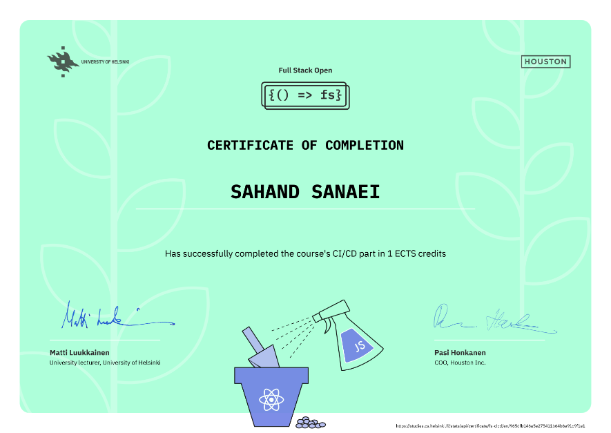

# summary

in this part, we went learned about **Continuous Integration(CI) and Continuous Development(CD)**. these terms refer to the constant process of merging developer chamges to the main branch, without breaking production. the tool that was used is **Github Actions**, a cloud-based CI setup solution. 
## certification

you can check grading system [here](https://fullstackopen.com/en/part0/general_info#parts-and-completion). 

