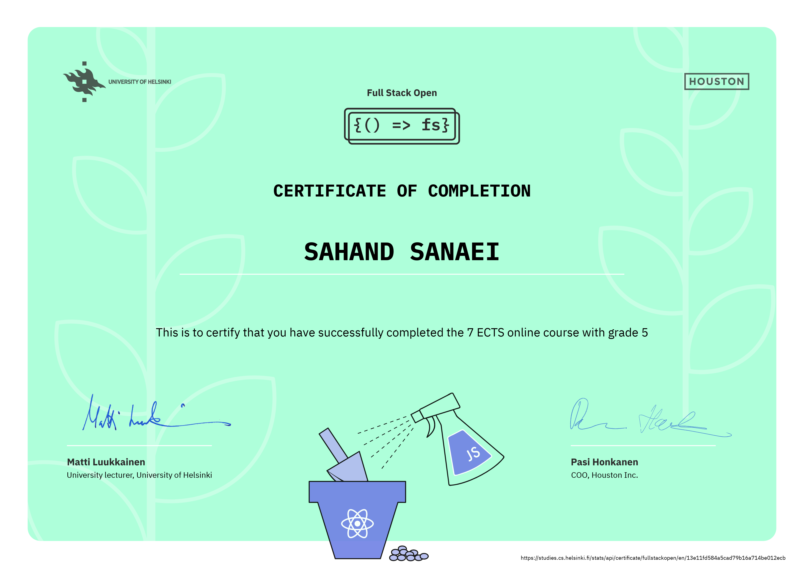

# summary

in this course, we went through a suite of packages, libraries and frameworks and learned many core ideas related to **full-stack, single-page, web applications**.

## ideas

* SPA vs traditional web applications
* JSON
* REASTful API
* same-origin-policy
* PaaS
* SQL vs NoSQL
* unit, integration, E2E testing
* XSS
* flux: unidirectional data flow
* server state vs client state
* webpack
* ...

## frontend packages and libraries

* React
* Axios
* JSON-server
* prop-type
* Redux and Redux-toolkit
* redux-thunk
* react-redux
* React Query
* React Router
* ...

## backend packages, libraries and frameworks

* Node.js
* Express
* Express middlewares: JSON-parser, morgan, cors, static
* mongoose and mongoose-unique-validator
* express-async-error
* dotenv
* bcrypt
* jsonwebtoken
* ...

## database 

* MongoDB
* Mongodb Atlas

## testing

* Jest
* supertest
* cross-env
* user-event
* deep-freeze
* Cypress
* ...

## styling

* react-bootstrap
* material UI
* styled-components
* ...

## other tools

* MermaidJS
* NPM
* VS code REST client and Postman
* ESLint
* ...

## certification

you can check grading system [here](https://fullstackopen.com/en/part0/general_info#parts-and-completion). 

