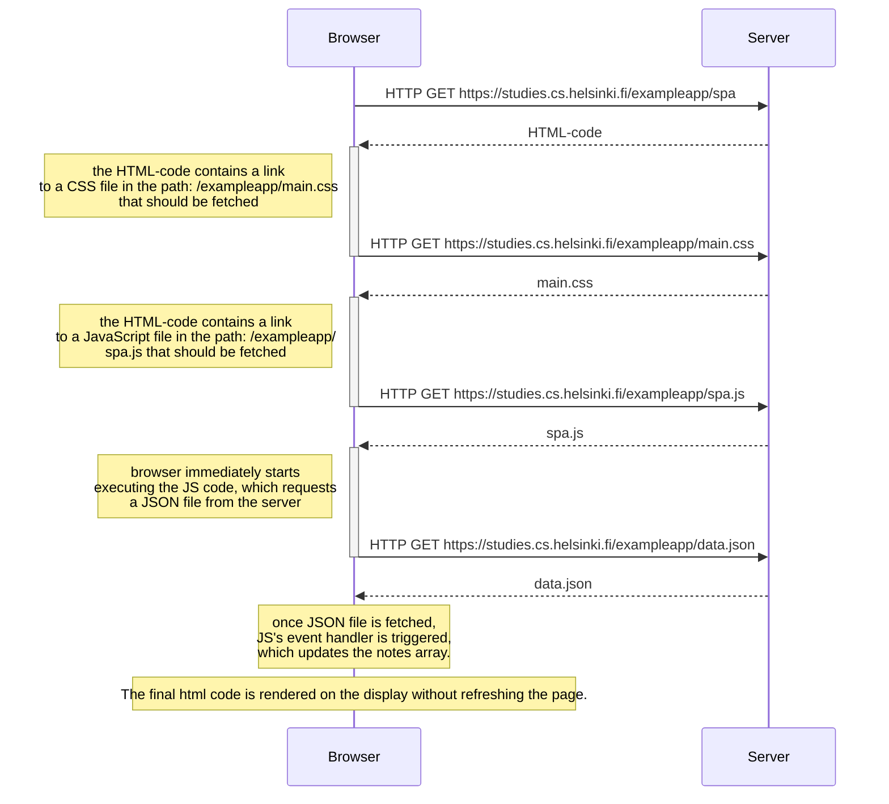

     sequenceDiagram
        participant b as Browser
        participant s as Server

        b->>s: HTTP GET https://studies.cs.helsinki.fi/exampleapp/spa
        s-->>+b: HTML-code
        note left of b: the HTML-code contains a link  to a CSS file in the path: /exampleapp/main.css  that should be fetched

        b->>-s: HTTP GET https://studies.cs.helsinki.fi/exampleapp/main.css
        s-->>+b: main.css
        note left of b: the HTML-code contains a link  to a JavaScript file in the path: /exampleapp/ spa.js that should be fetched

        b->>-s: HTTP GET https://studies.cs.helsinki.fi/exampleapp/spa.js
        s-->>+b: spa.js
        note left of b: browser immediately starts  executing the JS code, which requests  a JSON file from the server

        b->>-s: HTTP GET https://studies.cs.helsinki.fi/exampleapp/data.json
        s-->>b: data.json

        note over b: once JSON file is fetched,  JS's event handler is triggered,  causing a DOM-API manipulation.

        note over b: The final html code is rendered on the display. 

