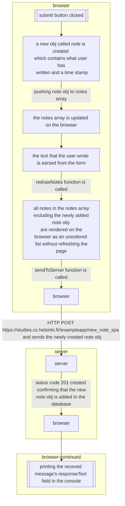

flowchart TB
    subgraph browser
    id[[submit button clicked]] --> id1[a new obj called note is created  which contains what user has  written and a time stamp] -- pushing note obj to notes array --> id2[the notes array is updated on the browser] --> id3[the text that the user wrote is earsed from the form] -- redrawNotes function is called --> id4[all notes in the notes array -including the newly added note obj-  are rendered on the browser as an unordered   list without refreshing the page] -- sendToServer function is called --> id5[browser]
    end

    subgraph server
    id5[browser] -- HTTP POST https://studies.cs.helsinki.fi//exampleapp/new_note_spa   and sends the newly created note obj --> id6[server] -- status code 201 created   confirming that the new note obj is added to the database --> id7[browser]
    end

    subgraph browser-continued
     id7[browser] --> id9[[printing the receved message's responseText field in the console]]
    end   

