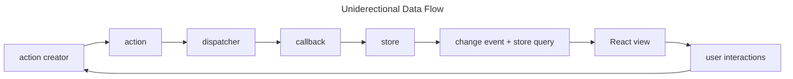

# summary

This part focused on state management solutions on both server-state and client-state.

## flux-architecture

developed by Facebook, this architecture for state emphezizes **uniderectional data flow**.

state is seperated from component and placed into its own *store*, which is the container that holds the app's global state as a JS obj (AKA the single source of truth). state in store should not be changed directly , but through *dispatching* an *action* to the *reducer function*. action obj has the filed 'type' to invoke the appropriate reducer function of the store. it might have additional info. in the field 'payload'. dispatching is the calling of an action obj on the store.

## server-state

up until this chapter, managing async. operations between server and client was done using *useEffect* hook of React.

**RTK Query API** is built on top of Redux toolkit's createSlice and createAsyncThunk and simplifys data fetching and caching logic. with createApi you define an 'API slice' that lists the server's base URL and endpints you want to interact with. this api slice auto generates both reducer redux reducer with its middleware and react hook for each end point. RTK will automatically fetch data on mount, refetch data when parametes change, provide values for data, isFetching, etc values, and re-render the component on when those values change.

**React Query**, which is now part of tanstack, is a an async. state management. with useQuery and useMutation you can quet and mutate data on the server, respectively. their returned obj has status, which tell you if the data is ready or not, and fetchStatus, which tells you if the queryFn is running or not, and change the return value of component. you can subsribe functions to useQuery and useMutation for different operation outcome, e.g. onSuccess or onError. re-fetching of data can be optimized through manually updating the query state, or disabling refetchOnWindowFocus.

## client-state

up until this chapter, storing async. data of the app. was done *locally* on componets with *useState*. one problem that might arise with this soultion is *prop drilling*. this undesired phenomenon was the motivation behind creatin of *global* state management solutions.

**Redux** uses flux architecture and utelizes previous state of the store, dispatch, and reducer to produce the next state of the store. reducer function must be a pure function and the state must be an immutable obj. **deep-freeze library** helps us ensure the immutability of reducer function in the tests. action creator is a function to factor out the implementation of action obj from the component. with **react-redux library** you can share redux store with all components. components are either *presentational*, meaning that they don't know anything about dispatching actions and just builds the UI, or *container*, which has the logic for state management. **Redux Toolkit library** is an extension of redux that simplifys the configuration of the redux app. reducer function defined with createSlice can mutate the state, since this function utelizes the **Immer library**, which generates a new state automatically. crrateSlice automatically generates action creators for each reducer. if the state of the application is crerated by configureStore, you can access redux devTools from the browser and access state or dispatch actions directly. with **redux-thunk library**, you can implement action creators that return a function instead of an action obj; this function can now be now use async/await operators and have access to dispatch and getState functions, with them it can dispatch async actions, so that the details of communication between frontend and backend is abstracted to action creators.

*Context API* is react's built-in solution for global state managementwith the help of hooks. useReducer is used to initialize store with reducer function, creating the state and its dispatcher. with context api, this state can be defined in a seperate file and accessed from any compenent.
