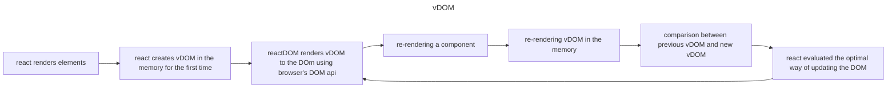

# summary

this part touched on a number of topics: react router, custom hooks, webpack, etc.

## react router

in SPA, unlike old-school web apps, changing pages is an illusion that is achieved through conditional rendering of components. we can reflect this idea using the history API of the browser and implement it with **react router library**. this library uses a number of components and hooks to allow us to link certain URL routes to specific component rendering. Also, we can access parameters in the URL, change the URL programmatically, and so on.

## custom hooks

react library is meant for the creation and management of views in the traditional MVC architecture. Hence, the logic that is not directly related to the rendering of views should be abstracted as much as possible.
implementing redux and flux architecture helps us to factor our state management. 
*abstracting logic* from the component can be implemented using custom hooks. when writing custom hooks the general rules of hooks must be followed.

## styling components

there are a number of ways for adding css to components in react. what must be considered is *modularity* of components, particularly when app is meant to be scalable. two popular methods are UI libraries and styled components.
### UI libraries
these can be ready-made themes, component-based, or utility-based libraries. **react bootstrap library** uses Bootstrap to create react components. **material UI library** uses material design visual language by google to do the same.
### styled components
**styled-component library** helps you define styles for components through tagged template literals. they are stored on the component itself and use HTML elements and build upon their functionality. 

## webpack

it is the tool used under the hood by create-react-app that configures the application.
previously, js code was stored in multiple files, and on the HTML file, multiple tags were used to import each one separately, which resulted in decreased performance. webpack's **bundling** allows us to pack js modules into one single file. bundling is started from the specified entry point and contains all the imported modules and libraries. 
only plain js code can be bundled by default, for react's jsx and css files **loaders** are used to inform webpack about the processing of those files before they are bundled. loaders such as babel, style-loader, css-loader, etc. 
webpack can be configured for a **devServer** which allows automatic browser refresh and boundling in memory, to speed up the development process. 
by enabling **source map**, you can access the original code before bundling in the devTool of the browser to easily find bugs. 
when webpack is run in the production mode, instead of the development, **minification** process optimizes the js code to not include any comments and the code resembles C language, among other techniques. 
not all js features are widely supported, which is why **polyfill** can help us to overcome the browser shortcomings in this area. promise-polyfill, for example, helps us implement promises for IE.

## reflecting server's changes

two mechanisms can be used to reflect the changes that happened to the server by other users in the app. **polling** on the frontend is repeated requests to the backend API to make sure that the current info available to the app is the latest. another method is using a browser API called **webSocket** with creates a two-way, synchronous connection between browser and server.

## virtual DOM

## common security issues

**injection attack** is when text sent from a form in an app is interpreted differently than software developer intended. SQL injections are common, but using parameterized queries prevents them. NoSQL databases can be vulnerable as well, however, mongoose sanitizes the queries. cross-site scripting(XSS) is another form of injection attack when specifically js code is injected and executed in the browser. React protects app by sanitizing data in variables.
**outdated security** of libraries must be regularly checked.
**broken authentication and broken access control** happen when the developer does not check the received data on the backend API and trusts the user. remember to use token-based authentication with HTTPS protocol to minimize the risk of foreign threats.

## current trends

typed version of js, server-side rendering, isomorphic app and universal code, progressive web apps, microservice architecture, serverless, etc.