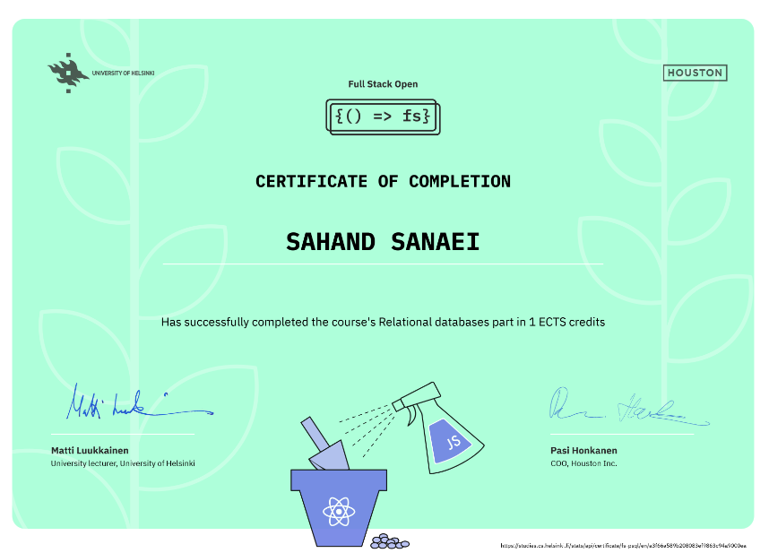

# summary

in this part we learned about **relational(SQL) databases** and their differences with non-relational(NoSQL) databases. we used **PostgresSQL** which is the most popular open source solution fro this kind of databases, and used the cloud provider **ElephantSQL** to access the database in the cloud. after learning about the basics of writing SQL queries, we used an **ORM** called **Sequelize** to manage the database more easily. we learned about the three types of **relations**: one-to-one, one-to-many, and many-tomany. in order to make changes to the db in a controlled manner, we learned about **migrations** and used **umzug** library to implement it in our database.

## certification

you can check grading system [here](https://fullstackopen.com/en/part0/general_info#parts-and-completion). 
