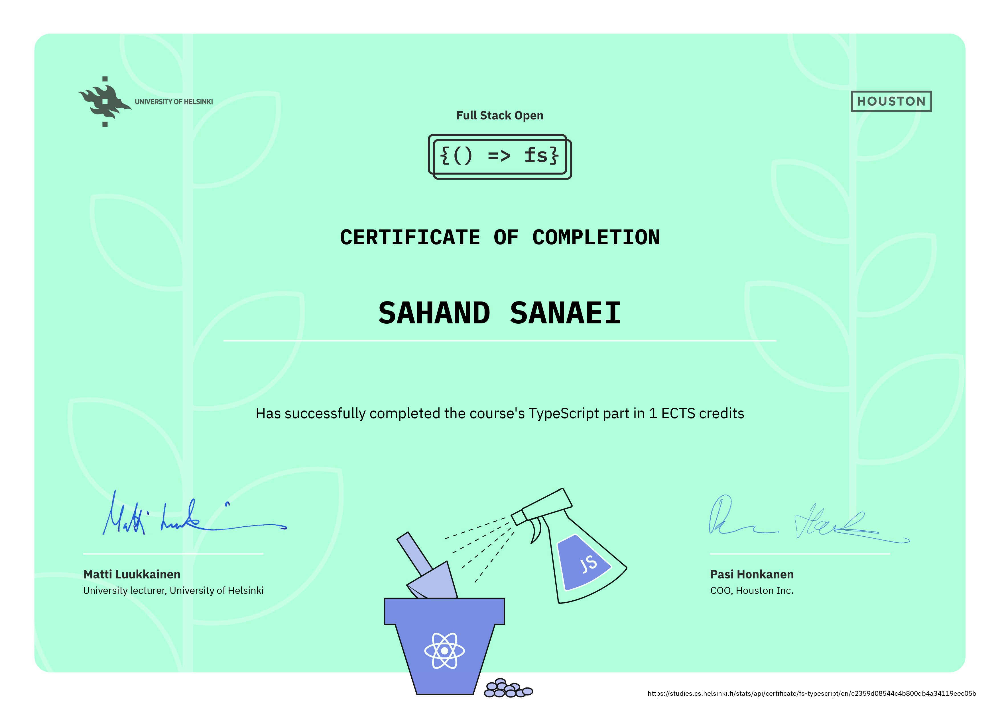

# summary

in this part, we went learned **TypeScript**, an open-source, typed superset of JavaScript, developed by Microsoft.
in the last exercise, **MaterialUI** was used to create React components for the client side.

## certification

you can check grading system [here](https://fullstackopen.com/en/part0/general_info#parts-and-completion). 

